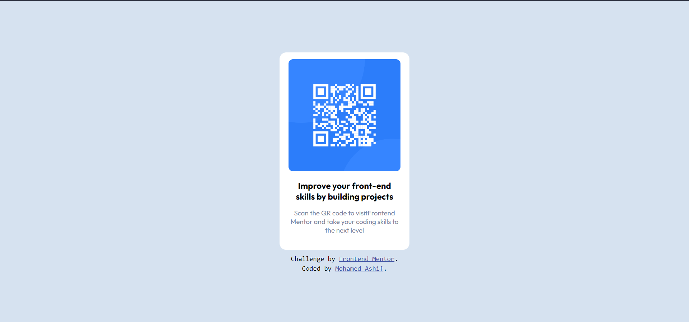

# Frontend Mentor - QR code component solution

This is a solution to the [QR code component challenge on Frontend Mentor](https://www.frontendmentor.io/challenges/qr-code-component-iux_sIO_H). Frontend Mentor challenges help me to improve my coding skills by building realistic projects.

## Table of contents

- [Screenshot](#screenshot)
- [Links](#links)
- [My process](#my-process)
  - [Continued development](#continued-development)
- [Author](#author)

### Screenshot

## My process

- Learning HTML,CSS,JAVASCRIPT

### Built with

- Semantic HTML5 markup
- CSS custom properties

### Continued development

After a Long time Started recalling the basics and currently focusing on ES6 Javascript and need to move in to Frameworks and Package Managers,Css Preprocess and I am Happily to Start the New Era and Focusing on myself in this CODING Field

## Author

- Frontend Mentor - [@Mhmd-Ashif](https://www.frontendmentor.io/profile/Mhmd-Ashif)
- Twitter - [@mhmdashif18](https://www.twitter.com/mhmdashif18)
